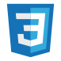

## React
- *JavaScript library* | 
- 
- Tags: WebDev
- Badges:
  - Web [blue]
- List Items:
  - Most popular library to build user interfaces using components

## Redux
- *JavaScript library* |
- 
- Tags: WebDev
- Badges:
  - Web [blue]
- List Items:
  - Open-source library for managing and centralizing application state

## HTML
- *HyperText Markup Language* | 
- 
- Tags: WebDev
- Badges:
  - Web [blue]
- List Items:
  - The standard markup language for documents designed to be displayed in a web browser

## CSS
- *Cascading Style Sheets* |
- 
- Tags: WebDev
- Badges:
  - Web [blue]
- List Items:
  - Style sheet language used to define styles for web pages

## Sass
- *Syntactically Awesome Style Sheets* |
- 
- Tags: WebDev
- Badges:
  - Web [blue]
- List Items:
  - Preprocessor scripting language for CSS

## JS
- *JavaScript* | 
- 
- Tags: WebDev
- Badges:
  - Web [blue]
- List Items:
  - Programming language that is one of the core technologies of the Web

## Node.js
- *JS* |
- 
- Tags: WebDev
- Badges:
  - Web [blue]
- List Items:
  - JavaScript runtime environment

## MongoDB
- *Database* |
- 
- Tags: WebDev
- Badges:
  - Web [blue]
- List Items:
  - NoSQL database management application

## PHP
- *Hypertext Preprocessor* |
- 
- Tags: WebDev
- Badges:
  - Web [blue]
- List Items:
  - Scripting language geared towards web development

## Figma
- *Web Design* | 
- 
- Tags: Tools
- Badges:
  - Design [blue]
- List Items:
  - Collaborative web application for interface design

## Trello
- *Kanban* | 
- 
- Tags: Tools
- Badges:
  - Management [blue]
- List Items:
  - Teamwork project management tool

## Feedly
- *News aggregator* |
- 
- Tags: Tools
- Badges:
  - Research [blue]
- List Items:
  - News feeds compiler from a variety of online sources

## Wordpress
- *Content Management System* |
- 
- Tags: Tools
- Badges:
  - CMS [blue]
- List Items:
  - Tool used to easily build websites

## Visual Studio Code
- *Code editor* |
- 
- Tags: Tools
- Badges:
  - IDE [blue]
- List Items:
  - Most popular source-code editor

## Oracle
- *Integrated Development Environment* | 
- 
- Tags: Tools
- Badges:
  - IDE [blue]
- List Items:
  - IDE for working with SQL in Oracle databases

## Office
- *Microsoft* | 
- 
- Tags: Tools
- Badges:
  - Tools [blue]
- List Items:
  - family of client software, server software, and services developed by Microsoft

## C++
- *Programming language* | 
- 
- Tags: Other
- Badges:
  - Programming [blue]
- List Items:
  - High-level, general-purpose programming language

## C#
- *Programming language* | 
- 
- Tags: Other
- Badges:
  - Programming [blue]
- List Items:
  - High-level, general-purpose programming language

## Python
- *Programming language* | 
- 
- Tags: Other
- Badges:
  - Programming [blue]
- List Items:
  - High-level, general-purpose programming language

## JAVA
- *Programming language* |
- 
- Tags: Other
- Badges:
  - Programming [blue]
- List Items:
  - Java is a high-level, class-based, object-oriented programming language

## MySQL
- *Database* |
- 
- Tags: Other
- Badges:
  - Database [blue]
- List Items:
  - MySQL is an open-source relational database management system
