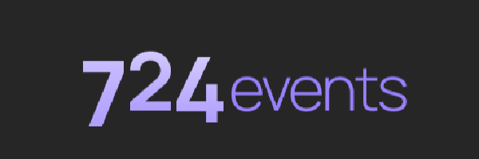
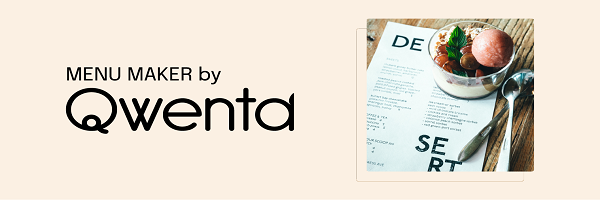

## ArgentBank
Online bank website made for training purpose
- 
- Tags: WebDev
- Badges:
  - React [blue]
  - Redux [blue]
  - Javascript [blue]
- Buttons:
  - Github [https://github.com/awzyy/argentbank-master]

## 724events
Debugging of an event website
- 
- Tags: WebDev
- Badges:
  - Debugging [blue]
  - SEO [blue]
- Buttons:
  - Github [https://github.com/awzyy/724events-master]

## Nina Carducci
Website optimisation for a photographer's website
- 
- Tags: WebDev
- Badges:
  - SEO [blue]
- Buttons:
  - Github [https://github.com/awzyy/ninacarducci-main]

## Kasa
Website to find accommodations made for training purpose
- 
- Tags: WebDev
- Badges:
  - React [blue]
- Buttons:
  - Github [https://github.com/awzyy/kasa]

## Menu Maker
Project plannification for website developpement
- 
- Tags: WebDev
- Badges:
  - Planning [blue]
- Buttons:
  - Trello [https://trello.com/b/OVAr0lr6/kanban-menu-maker-by-qwenta]